# Github环境配置新手指南（超详细）

Github是一个基于Git版本控制系统的代码托管平台，旨在帮助开发者协作、管理和追踪其软件项目的变化。

在这个平台，你可以找到各种代码资源，几乎所有程序员都在Github上建立过代码仓库，你甚至可以找到Linux创始人Linus大神或者DHH等一系列极客的仓库，所有开源项目如今也都会选择在Github平台发布。


而作为如今最流行的代码托管平台，Github的强大之处体现在以下特点：

版本控制： GitHub建立在Git版本控制系统之上，使开发者能够跟踪代码的变化、协作处理冲突以及恢复先前的版本。
代码托管： 开发者可以在GitHub上创建存储库（Repositories），将其代码存储在这些存储库中，并与团队成员或全球开发者社区分享。
分支管理： GitHub提供强大的分支管理功能，使开发者能够在不影响主要代码的情况下进行并行开发和实验性工作。
问题跟踪： 通过GitHub的问题跟踪系统，开发者可以报告问题、讨论新功能、提出建议，并在整个团队中进行透明的协作。
合并请求： 开发者可以通过合并请求向项目的主分支提交更改，同时进行讨论、审查代码，并最终将更改合并到主代码库中。
团队协作： GitHub支持多用户协作，允许开发者在同一项目中合作，并通过权限系统控制对存储库的访问权限。
自动化工具： GitHub集成了各种自动化工具和服务，如持续集成（Continuous Integration）和持续部署（Continuous Deployment），以简化开发流程。
社交网络： 开发者可以在GitHub上关注其他用户、项目或组织，以保持对感兴趣的项目的最新动态。
然而对于使用的初始阶段，Github也需要进行一些环境的初始化搭建，以下将逐步展示初始化的具体操作。

## 一、Github初始设置

### （一）登入Github

进入**Github官方网站**（https://github.com/），注册或者登录自己的Github账号。具体登录和注册步骤非常简单，这里不作演示。


（二）新建仓库
登录后即可进入Dashboard（看板）页面。由于代码需要用仓库储存，所以首先需要做的就是新建一个仓库。点击新建即可进入新建仓库页面。

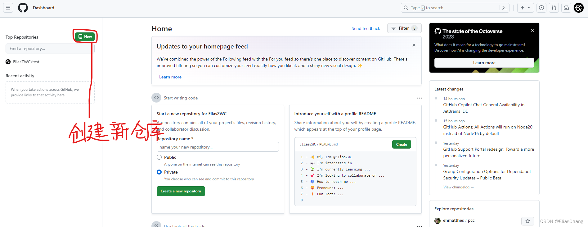

根据指引，新建一个仓库。我这里新建的库名叫做test，描述则为测试github。

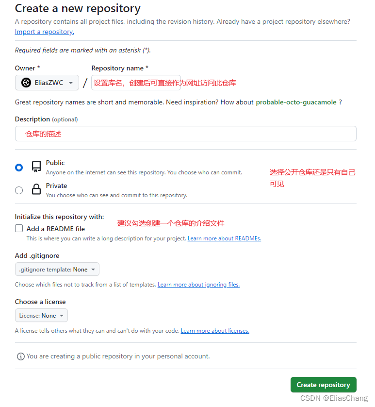

创建完成自己的库后，下面就需要克隆在Github创建完成的库到本地，以便于自己电脑上的代码可以同步到GitHub所创建的库当中。二、本地Git配置

### （一）安装Git

进入**Git官网**（https://git-scm.com/）下载Git安装包。

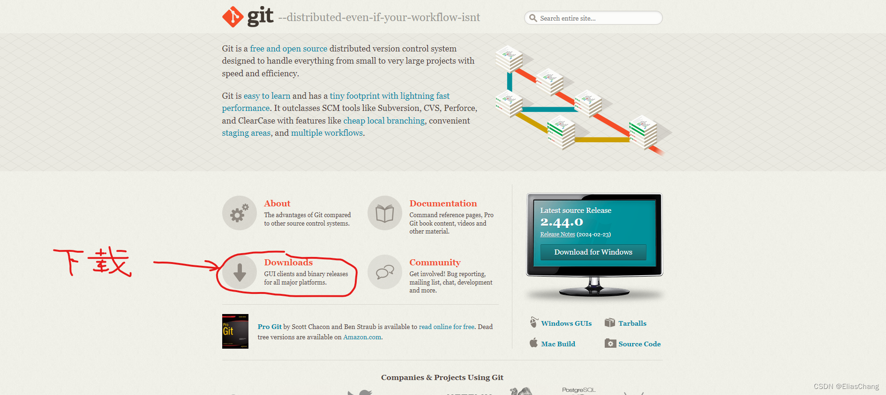

具体安装不再演示，可以设置一下安装的路径，其他设置均保持默认即可。

### （二）进入Git Bash

无论通过任务栏搜索还是创建快捷方式在桌面，进入Git Bash后将看到如下页面。在绿色的文字中，@前是是你的电脑用户名，@后面则是你的计算机型号，紫色文字则是你的系统型号。

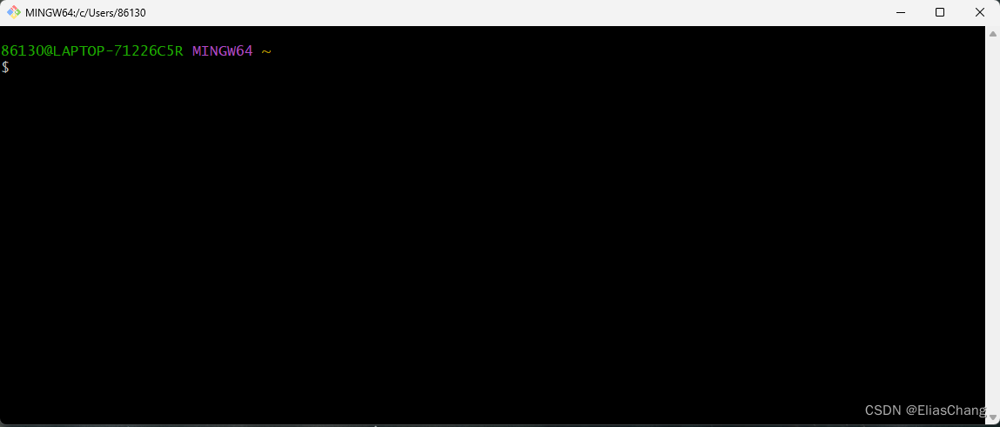

（三）配置用户
本地连接Github需要先配置用户，使用的bash命令如下。

```
git config --global user.name "github上注册的用户名" # 配置用户名
git config --global user.email "github上注册的邮箱" # 配置用户邮箱
git config --global user.name # 查看配置的用户名
git config --global user.email # 查看配置的用户邮箱
```

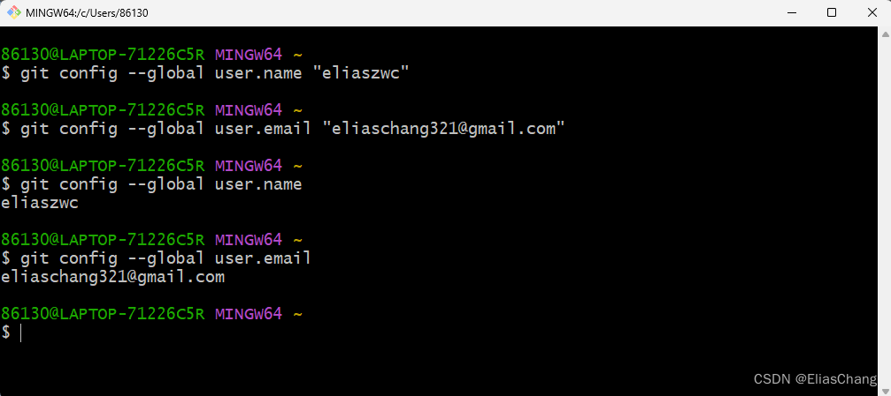

### （四）获取SSH密钥

想要本地同Github连接，必须先获取SSH密钥，获取密钥的Bash命令如下。

```
ssh-keygen -t rsa -C "GitHub上注册时的邮箱 "
```

此命令执行进程中需要用户的确认。

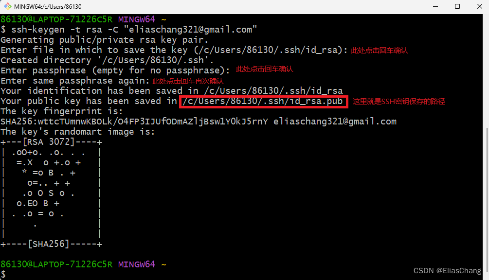

按照文件路径，即可找到SSH密钥的保存文件。值得注意的是，SSH密钥分为公钥和私钥，只有公钥才是我们需要的。

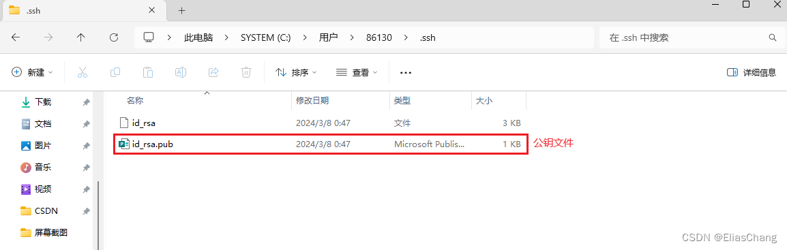

打开公钥文件（使用记事本就可以打开）可以看到公钥是一串以`ssh-rsa`为开头，你注册的邮箱为结尾的代码。将这串公钥复制，下一步将使用这串公钥。

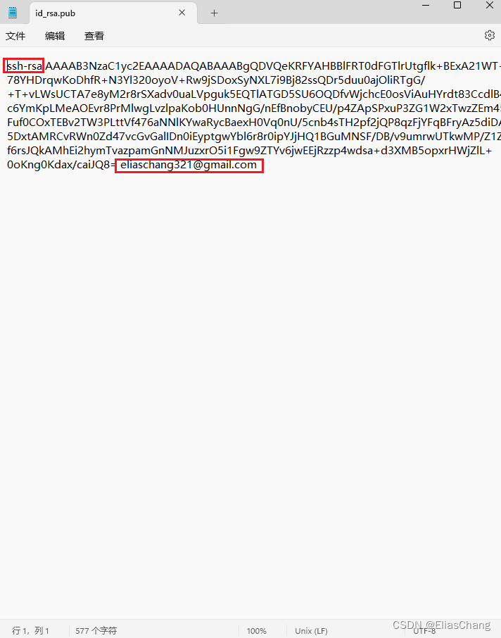

## 三、SSH连接Github

### （一）设置Github密钥

进入Github，点击左边的头像进入设置页面。

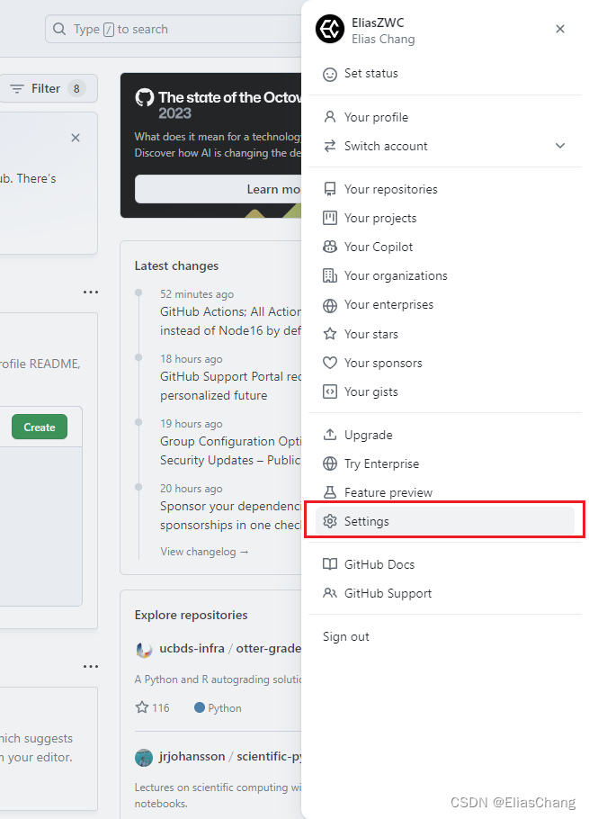

选择SSH与GPG密钥配置页面，建立新SSH密钥。

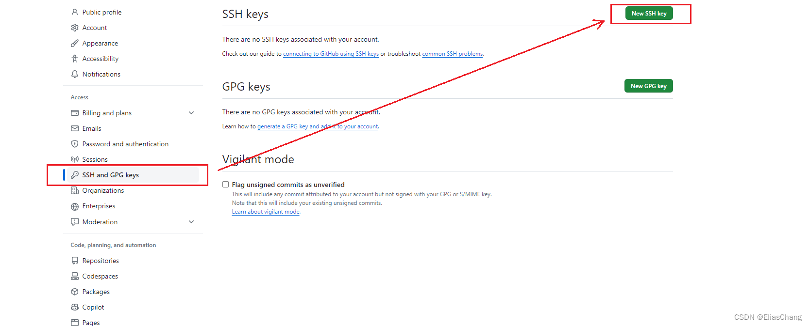

这里的标题是命名这个SSH密钥方便管理，我命名此密钥为笔记本（laptop），密钥则是刚才复制的SSH公钥。

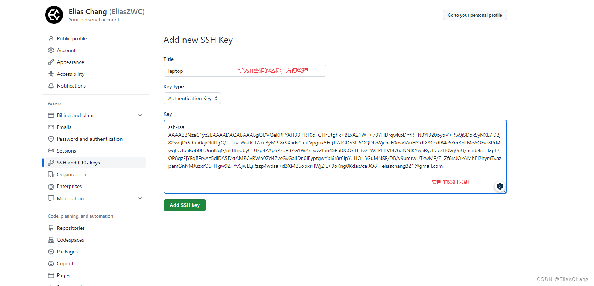

点击添加SSH密钥（Add SSH key）即可成功添加密钥。

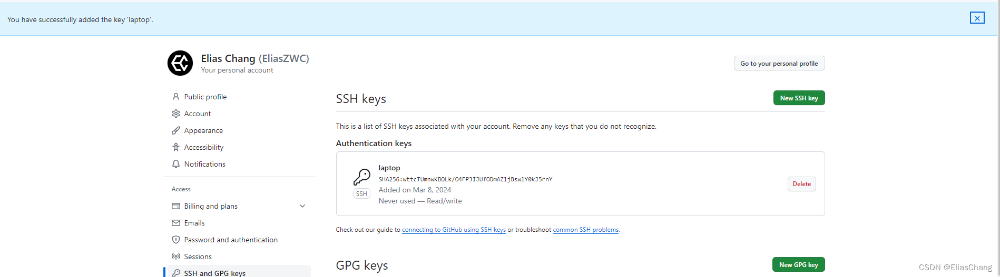

### （二）绑定SSH连接

由于Github获得了本地电脑SSH连接的密钥，所以理论上将只要使用就可以连接。返回Git Bash界面，使用以下Bash命令即可绑定与Github的连接。

```
ssh -T git@github.com
```

过程中会需要用户确定绑定，输入yes即可确定。返回以下结果即代表已成功绑定。

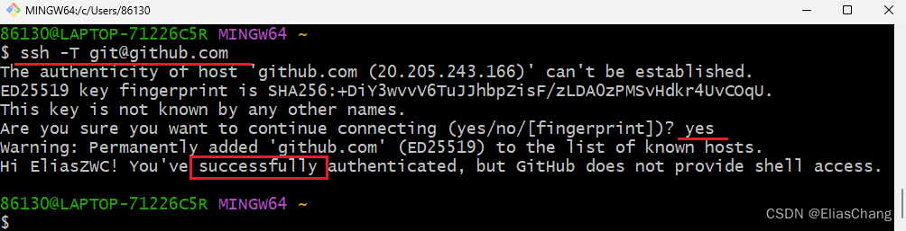

对于已经绑定好的Github，接下来还需要进行克隆（下载）到本地和上传到Github两方面的测试来确定一下功能是否可以正常使用。

## 四、测试下载Github仓库

### （一）获取仓库HTTPS链接

进入刚才建立的仓库，在代码选项中即可看到HTTPS链接，复制下来。

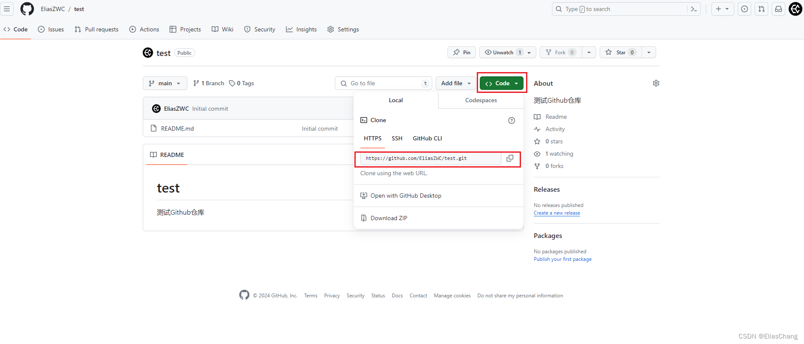

（二）仓库下载
对于下载的仓库，会需要一个文件路径来承载，本人习惯下载到E盘专门建立的github文件夹，方便管理。选择下载路径通过Bash命令进入那个你想要下载的文件路径下才可以。进入那个目录下就可以下载（克隆）Github仓库了。

另外，转移到某个目录下不确定有什么目录和文件也可以用ls命令来看一下。

```
cd /E/github # 转移到E盘的github目录下
git clone https://github.com/EliasZWC/test.git # 通过HTTPS链接克隆仓库到此文件夹下
```

出现以下返回结果则显示成功克隆仓库。

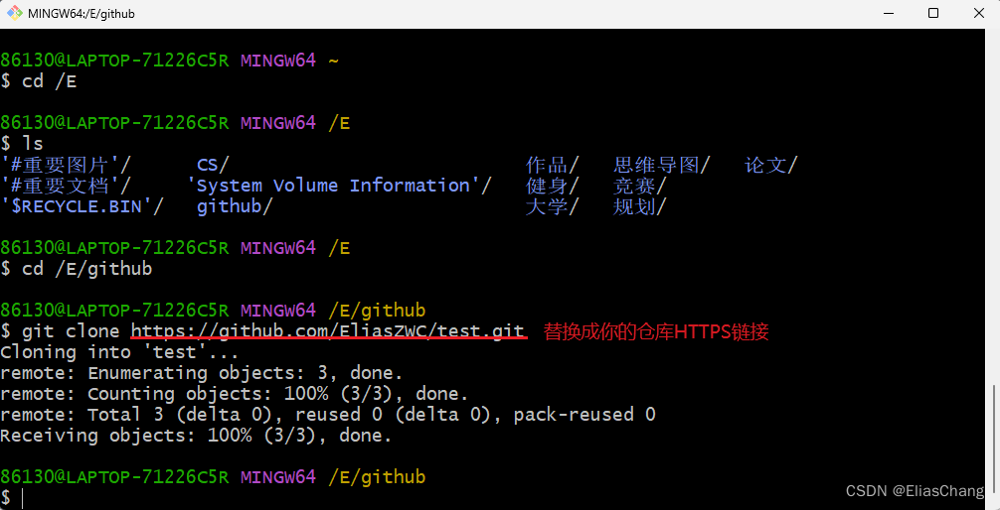

此时打开下载仓库的路径，就可以看到下载好的仓库，仓库中的readme文件也都下载了下来。

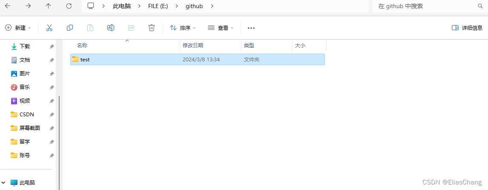

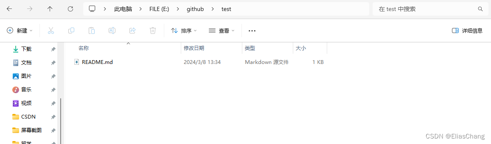

## 五、测试上传Github仓库

### （一）修改仓库文件

当本地仓库中的项目结构发生了改变，发生的改变想要上传同步都必须存入Git暂存区。

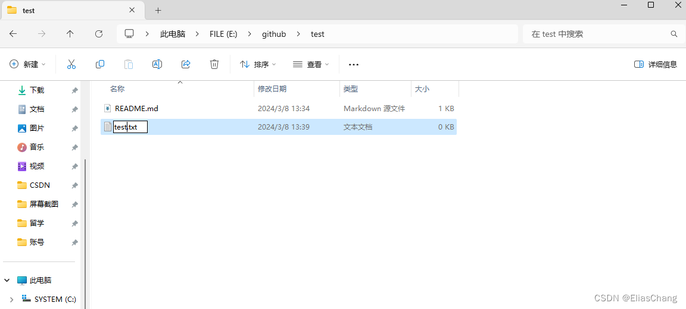

例如这里我建立了一个test.txt文件，希望上传时则必须存入Git暂存区，Bash命令如下。

```
cd ./test # 进入到test这个仓库文件目录下
git add test.txt
```

值得注意的是，我仅改变了一个文件，所以直接使用文件名添加指定文件到Git暂存区即可；但如果修改了多项文件，可以将文件名这里改为`.`即可将所有修改过的文件添加到暂存区。

### （二）提交仓库文件

当文件存入暂存区后，还需要将修改项目从暂存区提交更改到本地仓库，这里需要使用`git commit`命令。

```
git commit -m "for test" # 提交信息为for test
```

使用`-m`参数可以添加字符串作为提交信息，即注释。出现以下返回结果说明提交成功。

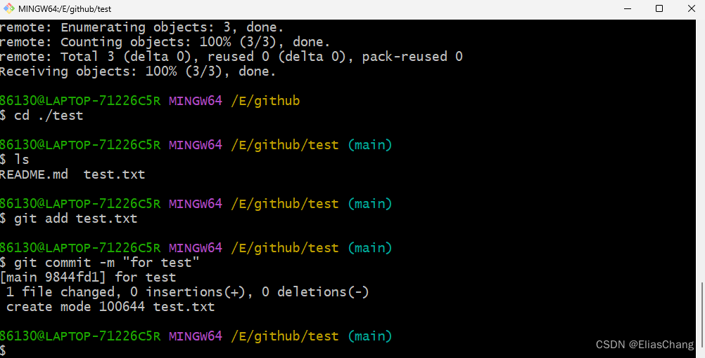

### （三）推送仓库文件

当仓库的更改项都已经提交到本地仓库中，此时就可以将更改后的仓库推送到远程Github仓库中了，Bash命令如下。

```
git push origin main
```

运行项目并下载源码
这里使用了Git系统的push命令，origin是远程仓库的默认别名，main则是进入test仓库文件夹时可以看到的本地分支名称。回车使用后会出现以下Github登录页面。

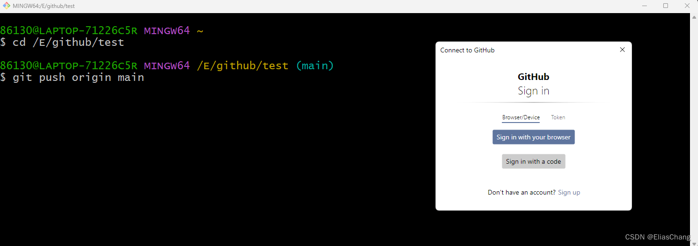

两个登录方式都可以，我这里用了浏览器登录（其实另一个验证码登录也需要进入浏览器）。选择账户继续（continue）授权。

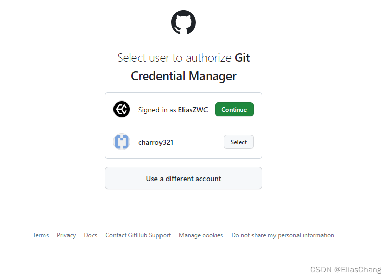

令Github账户授权给Git库。

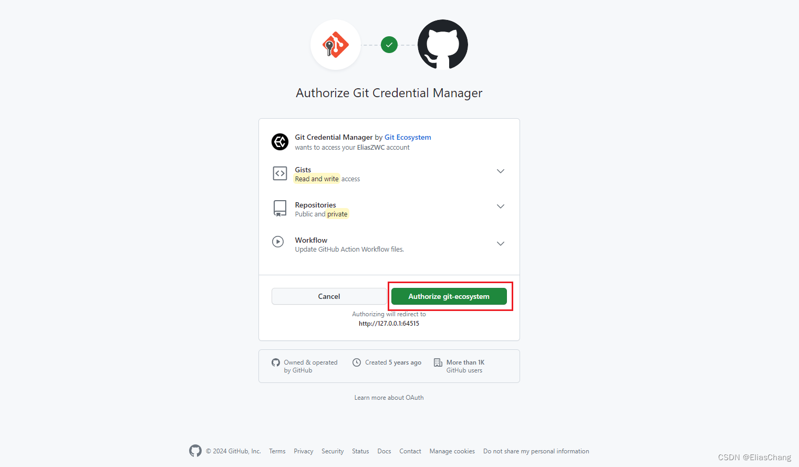

出现此页面即授权成功。


回到Git Bash页面，查看各种上传数据，果然成功。

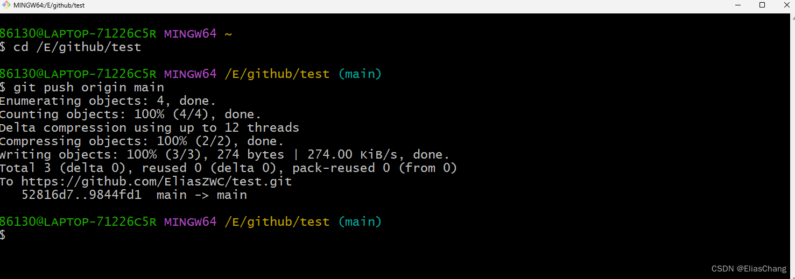

进入Github中的test仓库也可以看到test.txt成功上传，进入个人主页也可以看到贡献值绿了，这说明上传成功。

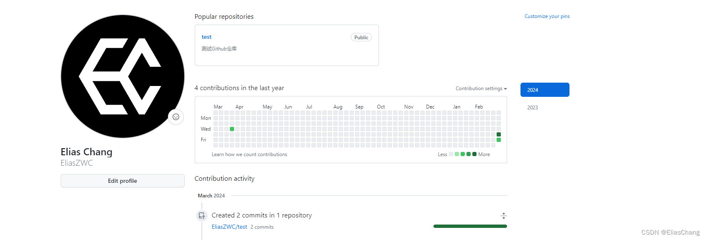

日后同样使用Git的`add`、`commit`和`push`这三个命令按同样原理上传文件（仓库）即可。